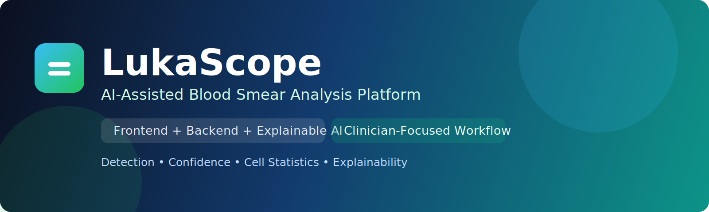
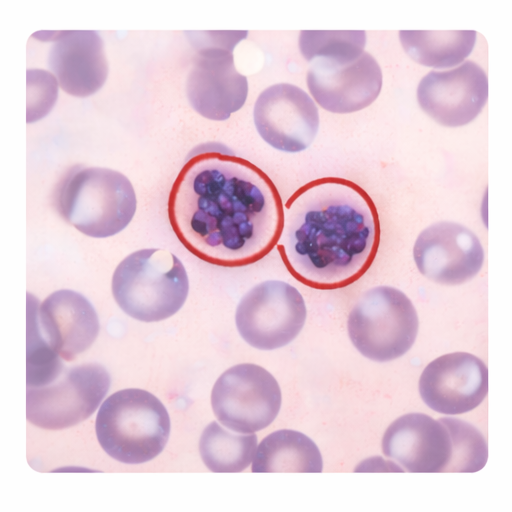
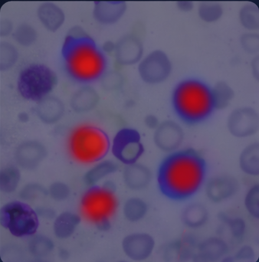
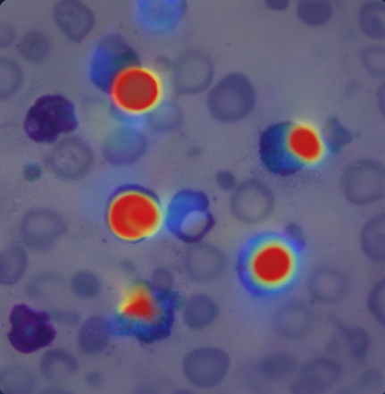
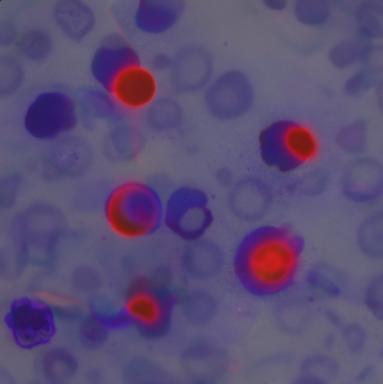
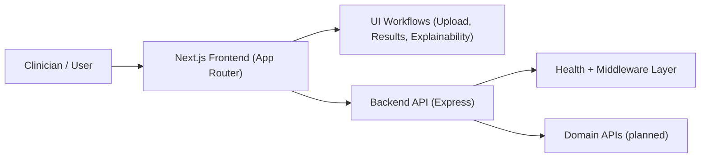

# LukaScope

<p align="center">
  
</p>

<p align="center">
  
</p>

[](./frontend)
[](./backend)
[](./frontend/tsconfig.json)
[](./package.json)

LukaScope is an AI-powered blood smear analysis platform designed to help clinicians detect potential leukemia **earlier, faster, and more consistently**.
As the model is trained on larger and more diverse datasets, the system is expected to improve sensitivity, robustness, and confidence calibration for earlier suspicious-case flagging and clinical review.
This repository contains both the frontend application and backend API in a Bun workspace monorepo.

## Table of Contents

- [Project Overview](#project-overview)
- [Project Aim](#project-aim)
- [Expected Outcomes](#expected-outcomes)
- [Current Status](#current-status)
- [AI Datasets and Training Plan](#ai-datasets-and-training-plan)
- [Training Methods and Model Strategy](#training-methods-and-model-strategy)
- [Screenshots](#screenshots)
- [System Architecture](#system-architecture)
- [Tech Stack](#tech-stack)
- [Repository Structure](#repository-structure)
- [Setup and Installation](#setup-and-installation)
- [Running the Project](#running-the-project)
- [Available Scripts](#available-scripts)
- [Environment Variables (Backend)](#environment-variables-backend)
- [API and Routes](#api-and-routes)
- [UI Pages](#ui-pages)
- [Future Improvements](#future-improvements)
- [Contributing](#contributing)
- [License](#license)

## Project Overview

LukaScope currently provides:

- A polished frontend workflow for login, dashboard, analysis simulation, result grid, and detailed result pages.
- A lightweight backend API service with security middleware and health monitoring endpoint.
- Static sample visual outputs for explainability-oriented UX demonstration.

## Project Aim

Deliver a clinician-friendly and explainable AI experience for blood smear analysis, with a strong foundation for production backend integration.

## Expected Outcomes

- Faster review workflows for uploaded samples.
- Consistent, visual reporting of confidence and cell context.
- Better trust through explainability imagery and clear result presentation.
- A clean codebase ready for iterative feature delivery.

## Current Status

| Area | Status | Notes |
|---|---|---|
| Frontend pages | Implemented | Login, dashboard, analysis overlay, results list, result detail |
| Frontend login endpoint | Implemented (MVP) | Static credential check in `frontend/app/api/login/route.ts` |
| Backend API skeleton | Implemented | Express app, middleware, health route |
| Domain APIs (auth/upload/results) | Planned | Not implemented yet |
| Persistent datastore layer | Planned | Not implemented in current cleanup state |

## AI Datasets and Training Plan

The following publicly available datasets are planned as the training foundation:

| Dataset | Why we use it | Notes |
|---|---|---|
| [C-NMC 2019 (TCIA)](https://www.cancerimagingarchive.net/collection/c-nmc-2019/) | Core leukemia classification data (normal vs malignant lymphoblasts) | Used in the ISBI 2019 ALL challenge; primary dataset for ALL-focused baseline training |
| [ALL-IDB (ALL-IDB1 / ALL-IDB2)](https://scotti.di.unimi.it/all/) | Additional ALL-focused microscopy data for generalization and robustness | Includes whole-image and cropped-cell variants suitable for classification and ROI analysis |
| [Raabin-WBC](https://www.raabindata.com/free-data/) | Large WBC morphology diversity to improve feature robustness and pretraining | Useful for representation learning and domain adaptation before ALL-specific fine-tuning |

Planned dataset workflow:

1. Build a versioned dataset registry (source, split, license, preprocessing metadata).
2. Standardize stain/illumination normalization across sources.
3. Split by patient where possible to reduce leakage risk.
4. Use controlled augmentation and class-balancing for stable training.

Important: dataset licenses/usage terms will be reviewed per source before production use.

## Training Methods and Model Strategy

Planned training pipeline for leukemia detection:

1. **Preprocessing**
Normalize stain/contrast, quality-filter blurred slides, and standardize image resolution.
2. **Cell/ROI localization**
Use detection/segmentation to isolate diagnostically relevant regions before final classification.
3. **Leukemia classification**
Train deep CNN/ViT backbones with transfer learning on ALL-focused labels (normal vs suspicious/malignant).
4. **Hybrid inference (optional)**
Fuse deep visual embeddings with classic ML (e.g., gradient boosting) for calibrated decision boundaries.
5. **Explainability layer**
Generate SHAP/gradient-guided heatmaps to show why the model flagged a sample.
6. **Continuous learning loop**
Use clinician-reviewed corrections and newly labeled data to improve performance over time.

Evaluation plan:

- Prioritize **sensitivity/recall** for early suspicious-case flagging.
- Track precision, AUROC, F1, calibration error, and false-negative rate.
- Validate across dataset domains to measure generalization and drift resilience.

## Screenshots

The images below are visual assets used by the current demo UI and explainability flow.

| Preview | What it shows |
|---|---|
|  | **Branding logo** used in the login/dashboard navigation context. |
|  | **Example blood smear sample** shown in results cards and detail views. |
|  | **SHAP explainability heatmap** highlighting influential regions for model prediction. |
|  | **Gradient-based explainability map** showing model attention across the image. |
|  | **Guided backpropagation view** for feature-level interpretation support. |

## System Architecture



## Tech Stack

### Frontend

- [Next.js 16](https://nextjs.org/) (App Router)
- React 19 + TypeScript
- Tailwind CSS v4
- Framer Motion
- shadcn/ui primitives in active use (`button`, `card`, `input`, `pagination`, `nav`)

### Backend

- Node.js + Express + TypeScript
- CORS + Helmet
- dotenv configuration

## Repository Structure

```text
LukaScope/
├── .gitignore
├── README.md
├── bun.lock
├── package.json
├── docs/
│   └── readme/
│       └── banner.svg
├── backend/
│   ├── .env.example
│   ├── .gitignore
│   ├── package.json
│   ├── tsconfig.json
│   └── server/
│       ├── index.ts
│       └── config/
│           └── index.ts
└── frontend/
    ├── .gitignore
    ├── app/
    │   ├── layout.tsx
    │   ├── page.tsx
    │   ├── globals.css
    │   ├── about/page.tsx
    │   ├── analysis/page.tsx
    │   ├── dashboard/page.tsx
    │   ├── results/page.tsx
    │   ├── results_id/page.tsx
    │   └── api/login/route.ts
    ├── components/
    │   ├── overlay.tsx
    │   ├── theme-provider.tsx
    │   └── ui/
    │       ├── button.tsx
    │       ├── card.tsx
    │       ├── input.tsx
    │       ├── nav.tsx
    │       └── pagination.tsx
    ├── lib/utils.ts
    ├── public/images/...
    ├── components.json
    ├── eslint.config.mjs
    ├── next.config.ts
    ├── package.json
    ├── postcss.config.mjs
    └── tsconfig.json
```

## Setup and Installation

### Prerequisites

- Node.js 20+
- Bun 1.3+

### 1) Clone and enter project

```bash
git clone <your-repo-url>
cd LukaScope
```

### 2) Install workspace dependencies

```bash
bun install
```

### 3) Configure backend environment

```bash
cp backend/.env.example backend/.env
```

## Running the Project

Run each service in its own terminal.

### Terminal A: Backend API

```bash
bun run dev:backend
```

Backend URL: `http://localhost:3001`  
Health check: `GET http://localhost:3001/health`

### Terminal B: Frontend App

```bash
bun run dev:frontend
```

Frontend URL: `http://localhost:3000`

## Available Scripts

### Root workspace (`/`)

| Command | Description |
|---|---|
| `bun run dev:frontend` | Start frontend dev server |
| `bun run dev:backend` | Start backend dev server |
| `bun run build:frontend` | Build frontend |
| `bun run build:backend` | Build backend |
| `bun run lint:frontend` | Run frontend lint |

### Package-local scripts

| Location | Command | Description |
|---|---|
| `frontend` | `bun run --cwd frontend dev` | Start Next.js dev server |
| `frontend` | `bun run --cwd frontend build` | Build frontend |
| `frontend` | `bun run --cwd frontend start` | Run frontend production server |
| `frontend` | `bun run --cwd frontend lint` | Run ESLint |
| `backend` | `bun run --cwd backend dev` | Start backend with `ts-node-dev` |
| `backend` | `bun run --cwd backend build` | Compile backend TypeScript |
| `backend` | `bun run --cwd backend start` | Run compiled backend |

## Environment Variables (Backend)

Based on [`backend/.env.example`](./backend/.env.example):

| Variable | Purpose | Example |
|---|---|---|
| `PORT` | API server port | `3001` |
| `NODE_ENV` | Runtime environment | `development` |
| `FRONTEND_URL` | CORS allowed origin | `http://localhost:3000` |

## API and Routes

### Implemented

- `GET /health` (backend health/status metadata)
- `POST /api/login` (frontend route handler for MVP login)

### Planned

- `/api/auth`
- `/api/upload`
- `/api/analysis`
- `/api/results`

## UI Pages

| Route | Purpose |
|---|---|
| `/` | Login screen (MVP static credential check) |
| `/dashboard` | Upload panel and project summary |
| `/analysis` | Simulated analysis overlay flow |
| `/results` | Paginated sample result grid |
| `/results_id` | Detailed single-sample result view |
| `/about` | About page placeholder |

## Future Improvements

### Near-term priorities

1. Implement backend domain route handlers (`auth`, `upload`, `analysis`, `results`).
2. Add a persistent data layer with migrations and seed workflows.
3. Replace static frontend login with backend authentication and role-based access.
4. Add API validation, error contracts, and standardized response schemas.

### Product and UX enhancements

1. Add real sample upload with progress, retry, and failure states.
2. Add filtering/search for results (date, confidence range, classification).
3. Add downloadable clinician-ready report views (PDF/CSV summaries).
4. Improve the `/about` and dashboard copy with real clinical workflow guidance.

### Engineering and quality improvements

1. Add automated tests: unit, integration, and end-to-end coverage.
2. Add CI pipeline for lint, build, and test gates before merge.
3. Add API docs (OpenAPI/Swagger) and example request/response payloads.
4. Add observability basics (structured logs, error tracking, uptime alerts).

## Contributing

1. Create a feature branch.
2. Keep changes scoped by layer (`frontend` or `backend`).
3. Run lint/build before opening a PR.
4. Update this README when behavior or setup changes.

## License

MIT (see [`backend/package.json`](./backend/package.json)).
