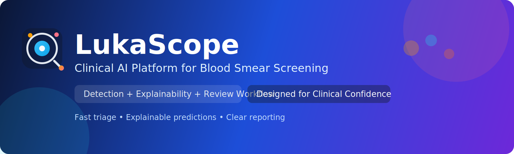
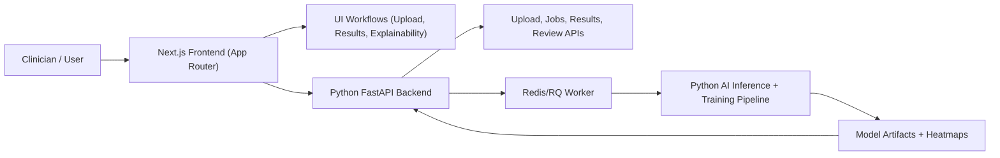

# LukaScope

<p align="center">
  
</p>

<p align="center">
  
</p>

<p align="center">
  <a href="./frontend"></a>
  <a href="./backend"></a>
  <a href="./frontend/tsconfig.json"></a>
  <a href="./package.json"></a>
</p>

<h2 align="center">AI-Assisted Leukemia Detection Platform</h2>
<h3 align="center">Earlier flagging • Faster screening support • More consistent clinical review</h3>

LukaScope is an AI-powered blood smear analysis platform designed to help clinicians detect potential leukemia **earlier, faster, and more consistently**.
As the model is trained on larger and more diverse datasets, the system is expected to improve sensitivity, robustness, and confidence calibration for earlier suspicious-case flagging and clinical review.
This repository contains a Next.js frontend and a Python FastAPI backend. Bun manages the frontend workspace; Python owns backend API, inference, and training workflows.

## Table of Contents

- [LukaScope](#lukascope)
  - [Table of Contents](#table-of-contents)
  - [Project Overview](#project-overview)
  - [Project Aim](#project-aim)
  - [Expected Outcomes](#expected-outcomes)
  - [Current Status](#current-status)
  - [AI Datasets and Training Plan](#ai-datasets-and-training-plan)
  - [Training Methods and Model Strategy](#training-methods-and-model-strategy)
  - [How Python Trains the AI](#how-python-trains-the-ai)
  - [Screenshots](#screenshots)
  - [System Architecture](#system-architecture)
  - [Tech Stack](#tech-stack)
    - [Frontend](#frontend)
    - [Backend](#backend)
    - [AI Training](#ai-training)
  - [Setup and Installation](#setup-and-installation)
    - [Prerequisites](#prerequisites)
    - [1) Clone and enter project](#1-clone-and-enter-project)
    - [2) Run With Docker](#2-run-with-docker)
    - [3) Optional Local Development Without Docker](#3-optional-local-development-without-docker)
    - [Workspace Dependency Model (Bun)](#workspace-dependency-model-bun)
  - [Running the Project](#running-the-project)
    - [Option A: Local Development Without Docker](#option-a-local-development-without-docker)
    - [Option B: Docker Deployment](#option-b-docker-deployment)
    - [Option C: Docker Development with Hot Reload](#option-c-docker-development-with-hot-reload)
  - [Available Scripts](#available-scripts)
    - [Root workspace (`/`)](#root-workspace-)
  - [Testing Strategy](#testing-strategy)
    - [Test Frameworks](#test-frameworks)
    - [Running Tests](#running-tests)
    - [Test execution model](#test-execution-model)
  - [Docker Deployment](#docker-deployment)
    - [Docker Architecture](#docker-architecture)
    - [Docker Files](#docker-files)
    - [Docker Commands](#docker-commands)
    - [Docker Benefits](#docker-benefits)
    - [Detailed Documentation](#detailed-documentation)
  - [Environment Variables (Backend)](#environment-variables-backend)
  - [API and Routes](#api-and-routes)
    - [Implemented](#implemented)
    - [Planned](#planned)
  - [UI Pages](#ui-pages)
  - [Future Improvements](#future-improvements)
    - [Near-term priorities](#near-term-priorities)
    - [Product and UX enhancements](#product-and-ux-enhancements)
    - [Engineering and quality improvements](#engineering-and-quality-improvements)
  - [Contributing](#contributing)
  - [Additional Documentation](#additional-documentation)
  - [License](#license)

## Project Overview

LukaScope currently provides:

- A polished frontend workflow for login, dashboard upload, analysis polling, result grid, and detailed result pages.
- A Python FastAPI backend for upload, analysis jobs, result persistence, clinician review, and health monitoring.
- A dedicated Python AI training workspace in `backend/ai` for dataset prep, preprocessing, and model training.
- File-backed upload, heatmap, reviewed dataset, and model artifact storage.
- Static sample visual outputs for explainability-oriented UX demonstration.

## Project Aim

Deliver a clinician-friendly and explainable AI experience for blood smear analysis, with a strong foundation for production backend integration.

## Expected Outcomes

- Faster review workflows for uploaded samples.
- Consistent, visual reporting of confidence and cell context.
- Better trust through explainability imagery and clear result presentation.
- A clean codebase ready for iterative feature delivery.

## Current Status

| Area                       | Status            | Notes                                                                        |
| -------------------------- | ----------------- | ---------------------------------------------------------------------------- |
| Frontend pages             | Implemented       | Login, dashboard, analysis overlay, results list, result detail              |
| Frontend login endpoint    | Implemented (MVP) | Static credential check in `frontend/app/api/login/route.ts`                 |
| Python backend API         | Implemented       | FastAPI health, upload, job polling, results, review, training-run endpoints |
| Async analysis             | Implemented       | Redis/RQ queue support with inline fallback for tests/local development      |
| Persistent datastore layer | Implemented       | SQLAlchemy with SQLite local default and Postgres support                    |

## AI Datasets and Training Plan

The following publicly available datasets are planned as the training foundation:

| Dataset                                                                          | Why we use it                                                                | Notes                                                                                       |
| -------------------------------------------------------------------------------- | ---------------------------------------------------------------------------- | ------------------------------------------------------------------------------------------- |
| [C-NMC 2019 (TCIA)](https://www.cancerimagingarchive.net/collection/c-nmc-2019/) | Core leukemia classification data (normal vs malignant lymphoblasts)         | Used in the ISBI 2019 ALL challenge; primary dataset for ALL-focused baseline training      |
| [ALL-IDB (ALL-IDB1 / ALL-IDB2)](https://scotti.di.unimi.it/all/)                 | Additional ALL-focused microscopy data for generalization and robustness     | Includes whole-image and cropped-cell variants suitable for classification and ROI analysis |
| [Raabin-WBC](https://www.raabindata.com/free-data/)                              | Large WBC morphology diversity to improve feature robustness and pretraining | Useful for representation learning and domain adaptation before ALL-specific fine-tuning    |

Planned dataset workflow:

1. Build a versioned dataset registry (source, split, license, preprocessing metadata).
2. Standardize stain/illumination normalization across sources.
3. Split by patient where possible to reduce leakage risk.
4. Use controlled augmentation and class-balancing for stable training.

Important: dataset licenses/usage terms will be reviewed per source before production use.

## Training Methods and Model Strategy

Planned training pipeline for leukemia detection:

1. **Preprocessing**
   Normalize stain/contrast, quality-filter blurred slides, and standardize image resolution.
2. **Cell/ROI localization**
   Use detection/segmentation to isolate diagnostically relevant regions before final classification.
3. **Leukemia classification**
   Train deep CNN/ViT backbones with transfer learning on ALL-focused labels (normal vs suspicious/malignant).
4. **Hybrid inference (optional)**
   Fuse deep visual embeddings with classic ML (e.g., gradient boosting) for calibrated decision boundaries.
5. **Explainability layer**
   Generate SHAP/gradient-guided heatmaps to show why the model flagged a sample.
6. **Continuous learning loop**
   Use clinician-reviewed corrections and newly labeled data to improve performance over time.

Evaluation plan:

- Prioritize **sensitivity/recall** for early suspicious-case flagging.
- Track precision, AUROC, F1, calibration error, and false-negative rate.
- Validate across dataset domains to measure generalization and drift resilience.

## How Python Trains the AI

Python is the training environment for LukaScope models, while the backend serves application APIs.

Training workflow in Python (`backend/ai`):

1. Load and validate datasets via `hooks/` modules.
2. Preprocess and standardize microscopy images via `functions/`.
3. Train leukemia detection/classification models with PyTorch/Ultralytics.
4. Evaluate recall-first performance and calibration metrics.
5. Export model artifacts for inference integration in the app stack.

Current AI folder layout:

- `backend/ai/hooks/`: dataset loading and source-specific hooks
- `backend/ai/functions/`: preprocessing and training functions
- `backend/ai/requirements.txt`: Python training dependencies

The FastAPI backend serves inference outputs while `backend/ai` remains focused on dataset preparation and training scripts.

## Screenshots

The images below are visual assets used by the current demo UI and explainability flow.

| Preview                                                                                                           | Description                                                                            |
| ----------------------------------------------------------------------------------------------------------------- | -------------------------------------------------------------------------------------- |
|                 | **Branding logo** used in the login/dashboard navigation context.                      |
|           | **Example blood smear sample** shown in results cards and detail views.                |
|              | **SHAP explainability heatmap** highlighting influential regions for model prediction. |
|      | **Gradient-based explainability map** showing model attention across the image.        |
|  | **Guided backpropagation view** for feature-level interpretation support.              |

## System Architecture



## Tech Stack

### Frontend

- [Next.js 16](https://nextjs.org/) (App Router)
- React 19 + TypeScript
- Tailwind CSS v4
- Framer Motion
- shadcn/ui primitives in active use (`button`, `card`, `input`, `pagination`, `nav`)

### Backend

- FastAPI + Python 3.11+
- SQLAlchemy persistence with SQLite local default and Postgres support
- Redis/RQ background jobs for inference and retraining
- File-backed upload, heatmap, dataset, and model artifact storage

### AI Training

- Python 3.11+
- PyTorch + TorchVision
- Ultralytics (YOLO family)
- scikit-learn
- OpenCV + Albumentations
- SHAP + Matplotlib
- Dedicated training workspace in `backend/ai` split into `hooks/` and `functions/`

## Setup and Installation

### Prerequisites

**Docker Run**:

- Docker 20.10+
- Docker Compose 2.0+

**Local Development Without Docker**:

- Node.js 20+
- Bun 1.3+
- Python 3.11+ (for backend API, workers, and AI training scripts)

### 1) Clone and enter project

```bash
git clone https://github.com/richardwaters9049/LukaScope.git
cd LukaScope
```

### 2) Run With Docker

This is the recommended path for running the whole app. It does not require Bun, Node.js, Python, Postgres, or Redis to be installed on your host machine.

```bash
./scripts/docker-up.sh
```

Then open:

```text
http://localhost:3000
```

This starts the frontend, Python backend, worker, Redis, and Postgres.

### 3) Optional Local Development Without Docker

```bash
# Install frontend workspace dependencies
bun install

# Configure backend environment and install Python API dependencies
cp backend/.env.example backend/.env
cd backend
python -m venv .venv
source .venv/bin/activate
pip install -r requirements.txt
```

Optional AI training environment:

```bash
cd backend/ai
python -m venv .venv
source .venv/bin/activate
pip install -r requirements.txt
```

### Workspace Dependency Model (Bun)

- Bun is installed once on the machine, not once per directory.
- Run `bun install` from the repo root only.
- Do not run a separate `bun install` inside `frontend/`.
- Bun manages the frontend workspace dependencies only.
- Install Python backend dependencies inside `backend/.venv`.
- Do not add Python backend dependencies to Bun manifests.

## Running the Project

### Option A: Local Development Without Docker

Run each service in its own terminal.

**Terminal A: Backend API**

```bash
cd backend
source .venv/bin/activate
bun run dev:backend
```

Backend URL: `http://localhost:3001`
Health check: `GET http://localhost:3001/health`

**Terminal B: Frontend App**

```bash
bun run dev:frontend
```

Frontend URL: `http://localhost:3000`

**Terminal C: Python worker**

```bash
cd backend
source .venv/bin/activate
python -m app.worker
```

### Option B: Docker Deployment

```bash
# Build and start all services
./scripts/docker-up.sh

# View logs
docker-compose -f docker/docker-compose.yml logs -f

# Stop services
docker-compose -f docker/docker-compose.yml down
```

**Service URLs**:

- Frontend: `http://localhost:3000`
- Backend: `http://localhost:3001`

### Option C: Docker Development with Hot Reload

For development with live code reloading:

```bash
# Use development configuration with hot reload
./scripts/docker-dev.sh

# View logs
docker-compose -f docker/docker-compose.dev.yml logs -f frontend
docker-compose -f docker/docker-compose.dev.yml logs -f python-backend
docker-compose -f docker/docker-compose.dev.yml logs -f worker

# Stop development services
docker-compose -f docker/docker-compose.dev.yml down
```

**Key Development Features**:

- Volume mounts sync local code changes to containers
- Frontend uses Next.js dev server with hot reload
- Backend uses Uvicorn with auto-reload
- Worker runs the Redis/RQ queue consumer
- Changes on host filesystem are reflected immediately
- No data loss when containers are restarted

**Important**: Use `docker/docker-compose.dev.yml` for development, not `docker/docker-compose.yml` (which is production-only without hot reload).

## Available Scripts

### Root workspace (`/`)

| Command                  | Description                           |
| ------------------------ | ------------------------------------- |
| `bun run dev:frontend`   | Start frontend dev server             |
| `bun run dev:backend`    | Start Python backend dev server       |
| `bun run dev:worker`     | Start Python analysis/training worker |
| `bun run build:frontend` | Build frontend                        |
| `bun run build:backend`  | Compile Python backend                |
| `bun run lint:frontend`  | Run frontend lint                     |
| `bun run test`           | Run all frontend and backend tests    |
| `bun run test:frontend`  | Run frontend tests                    |
| `bun run test:backend`   | Run backend tests                     |
| `bun run test:ai`        | Run AI training tests                 |
| `bun run test:coverage`  | Run all tests with coverage reports   |

## Testing Strategy

Testing infrastructure has been implemented with frameworks and Docker integration. Test suites are in early development with example tests provided.

### Test Frameworks

**Frontend Testing (Jest + React Testing Library)**:

- Unit tests for UI components, utility functions, and page-level logic
- Integration tests for key flows: login, dashboard interactions, analysis state transitions, and results rendering
- End-to-end tests for critical user journeys in a browser environment
- Accessibility and regression checks on core pages before release

**Backend Testing (pytest + FastAPI TestClient)**:

- API tests for health, upload, job polling, result retrieval, review, and training-run creation
- Unit tests for storage, inference contracts, and reviewed-data retraining eligibility
- Worker tests for inference and candidate retraining behavior

**AI Training Testing (pytest + pytest-cov)**:

- Unit tests for data preprocessing functions
- Integration tests for model training pipeline
- Validation tests for model outputs and metrics
- Data integrity tests for dataset loading

### Running Tests

**Local Testing**:

```bash
# Run all tests
bun run test

# Run specific service tests
bun run test:frontend
bun run test:backend
bun run test:ai

# Run with coverage
bun run test:coverage
```

**Docker Testing**:

```bash
# Run all tests in Docker
docker-compose -f docker/docker-compose.test.yml up --build

# Run specific service tests
docker-compose -f docker/docker-compose.test.yml up frontend-test
docker-compose -f docker/docker-compose.test.yml up backend-test
docker-compose -f docker/docker-compose.test.yml --profile ai up ai-test
```

### Test execution model

1. Run fast unit tests on every commit/PR
2. Run integration + end-to-end suites in CI before merge
3. Block merges when lint/build/tests fail
4. Track coverage trend and enforce minimum thresholds as the suite grows

**Coverage Reports**:

- Frontend: `frontend/coverage/`
- Backend: `backend/coverage/`
- AI: `backend/ai/htmlcov/`

## Docker Deployment

The project includes comprehensive Docker containerization for production deployment and isolated testing environments.

### Docker Architecture

- **Frontend Container**: Next.js 16 with Bun runtime (multi-stage build)
- **Backend Container**: FastAPI Python runtime
- **Worker Container**: Redis/RQ worker for inference and retraining
- **Postgres/Redis Containers**: Metadata persistence and async queue services
- **Test Containers**: Dedicated test stages for each service

### Docker Files

- `docker/docker-compose.yml` - Main orchestration for production services
- `docker/docker-compose.dev.yml` - Development orchestration with hot reload
- `docker/docker-compose.test.yml` - Test orchestration for all services
- `frontend/Dockerfile` - Multi-stage build for Next.js (includes dev stage)
- `backend/Dockerfile` - Build for FastAPI backend, worker, and backend tests
- `backend/ai/Dockerfile` - Python AI training environment
- `.dockerignore` files - Build context optimization

### Docker Commands

**Production Deployment**:

```bash
# Build and start all services
./scripts/docker-up.sh

# View logs
docker-compose -f docker/docker-compose.yml logs -f

# Stop services
docker-compose -f docker/docker-compose.yml down

# Rebuild specific service
docker-compose -f docker/docker-compose.yml up -d --build frontend
```

**Development with Hot Reload**:

```bash
# Use development configuration with hot reload
./scripts/docker-dev.sh

# View logs
docker-compose -f docker/docker-compose.dev.yml logs -f frontend
docker-compose -f docker/docker-compose.dev.yml logs -f python-backend
docker-compose -f docker/docker-compose.dev.yml logs -f worker

# Stop development services
docker-compose -f docker/docker-compose.dev.yml down
```

**Testing with Docker**:

```bash
# Run all tests
docker-compose -f docker/docker-compose.test.yml up --build

# Run specific service tests
docker-compose -f docker/docker-compose.test.yml up frontend-test
docker-compose -f docker/docker-compose.test.yml up backend-test
```

**AI Training**:

```bash
# Run AI training on-demand
docker-compose -f docker/docker-compose.yml --profile ai up ai-training

# Run custom AI command
docker-compose -f docker/docker-compose.yml --profile ai run ai-training python functions/evaluate_model.py
```

### Docker Benefits

- **Consistency**: Same environment across development, testing, and production
- **Isolation**: Each service runs in isolated containers
- **Portability**: Deploy anywhere Docker is available
- **Scalability**: Easy horizontal scaling with Docker Swarm or Kubernetes
- **Testing**: Dedicated test stages for CI/CD integration

### Detailed Documentation

For comprehensive Docker documentation, see [`DOCKER.md`](./docker/DOCKER.md).

## Environment Variables (Backend)

Based on [`backend/.env.example`](./backend/.env.example):

| Variable       | Purpose             | Example                 |
| -------------- | ------------------- | ----------------------- |
| `PORT`         | API server port     | `3001`                  |
| `NODE_ENV`     | Runtime environment | `development`           |
| `FRONTEND_URL` | CORS allowed origin | `http://localhost:3000` |

## API and Routes

### Implemented

- `GET /health` (backend health/status metadata)
- `POST /api/login` (frontend route handler for MVP login)

### Planned

- `/api/auth`
- `/api/upload`
- `/api/analysis`
- `/api/results`

## UI Pages

| Route         | Purpose                                    |
| ------------- | ------------------------------------------ |
| `/`           | Login screen (MVP static credential check) |
| `/dashboard`  | Upload panel and project summary           |
| `/analysis`   | Simulated analysis overlay flow            |
| `/results`    | Paginated sample result grid               |
| `/results_id` | Detailed single-sample result view         |
| `/about`      | About page placeholder                     |

## Future Improvements

### Near-term priorities

1. Implement backend domain route handlers (`auth`, `upload`, `analysis`, `results`).
2. Add a persistent data layer with migrations and seed workflows.
3. Replace static frontend login with backend authentication and role-based access.
4. Add API validation, error contracts, and standardized response schemas.

### Product and UX enhancements

1. Add real sample upload with progress, retry, and failure states.
2. Add filtering/search for results (date, confidence range, classification).
3. Add downloadable clinician-ready report views (PDF/CSV summaries).
4. Improve the `/about` and dashboard copy with real clinical workflow guidance.

### Engineering and quality improvements

1. ✅ Add automated tests: unit, integration, and end-to-end coverage (frameworks implemented)
2. Add CI pipeline for lint, build, and test gates before merge.
3. Add API docs (OpenAPI/Swagger) and example request/response payloads.
4. Add observability basics (structured logs, error tracking, uptime alerts).
5. Add experiment tracking/versioning for Python training runs (metrics, datasets, checkpoints).

## Contributing

1. Create a feature branch.
2. Keep changes scoped by layer (`frontend` or `backend`).
3. Run lint/build/tests before opening a PR.
4. Update this README when behavior or setup changes.

## Additional Documentation

- [`DOCKER.md`](./docker/DOCKER.md) - Comprehensive Docker deployment and testing guide
- [`AGENTS.md`](./AGENTS.md) - Project guidelines for AI agents and developers
- [`backend/ai/README.md`](./backend/ai/README.md) - AI training workflow documentation

## License

MIT.
